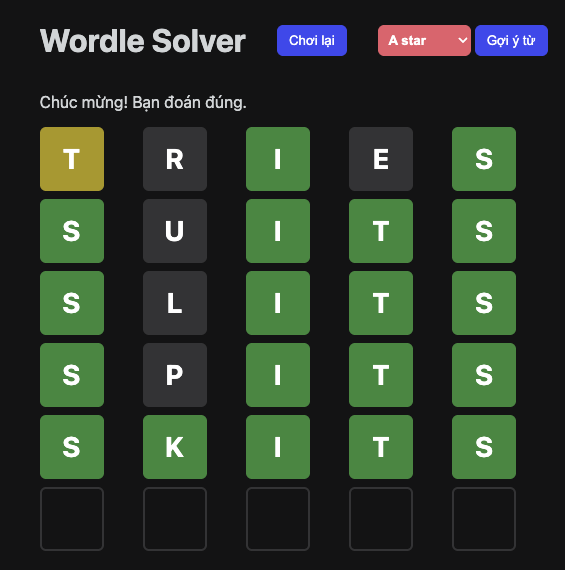

# Wordle Solver

Wordle Solver là một trò chơi đoán từ 5 chữ cái lấy cảm hứng từ Wordle, đi kèm tính năng gợi ý từ theo nhiều thuật toán AI như A*, Entropy và Bayesian.

## Demo



## Cách chơi

1. Mỗi ván có 6 lượt đoán.
2. Nhập một từ hợp lệ gồm 5 chữ cái bằng bàn phím hoặc bàn phím ảo trên giao diện.
3. Nhấn Enter để xác nhận lượt đoán.
4. Màu sắc của từng ô sẽ cho biết mức độ đúng của chữ cái:
	- Xanh lá: đúng chữ cái, đúng vị trí.
	- Vàng: đúng chữ cái, sai vị trí.
	- Xám: chữ cái không có trong đáp án.
5. Dựa vào phản hồi, tiếp tục đoán cho đến khi tìm ra đáp án hoặc hết 6 lượt.
6. Có thể nhấn **Chơi lại** để bắt đầu ván mới.
7. Nếu muốn dùng AI hỗ trợ, chọn thuật toán rồi nhấn **Gợi ý từ** để hệ thống tự đề xuất lượt đoán tiếp theo.

## Cài đặt

### Yêu cầu

- Python 3.8 trở lên
- `pip`

### Cài dependencies

Từ thư mục gốc của dự án, chạy:

```bash
pip install -r requirements.txt
```

Nếu máy bạn dùng `python3` thay vì `python`, có thể cài bằng:

```bash
python3 -m pip install -r requirements.txt
```

## Chạy ứng dụng

1. Mở terminal tại thư mục gốc của dự án.
2. Chạy lệnh sau để khởi động server Flask:

```bash
cd Source
python main.py
```

3. Mở trình duyệt và truy cập địa chỉ được in ra trên terminal, thường là:

```text
http://127.0.0.1:5000
```

## Cấu trúc chính

- `Source/main.py`: server Flask và API gợi ý từ.
- `Source/Entropy.py`, `Source/Astar.py`, `Source/BayesianSolver.py`: các thuật toán hỗ trợ đoán từ.
- `Source/Filter.py`: lọc từ hợp lệ theo phản hồi của người chơi.
- `Source/templates/index.html`: giao diện trò chơi.
- `Source/static/app.js`: logic tương tác phía client.
- `Source/static/words.txt`: danh sách từ dùng trong game.

## Ghi chú

- Danh sách từ hiện tại là tiếng Anh và tập trung vào các từ 5 chữ cái.
- Khi chạy ở chế độ demo, nếu không tải được danh sách từ từ server, ứng dụng sẽ dùng một danh sách dự phòng nhỏ.
